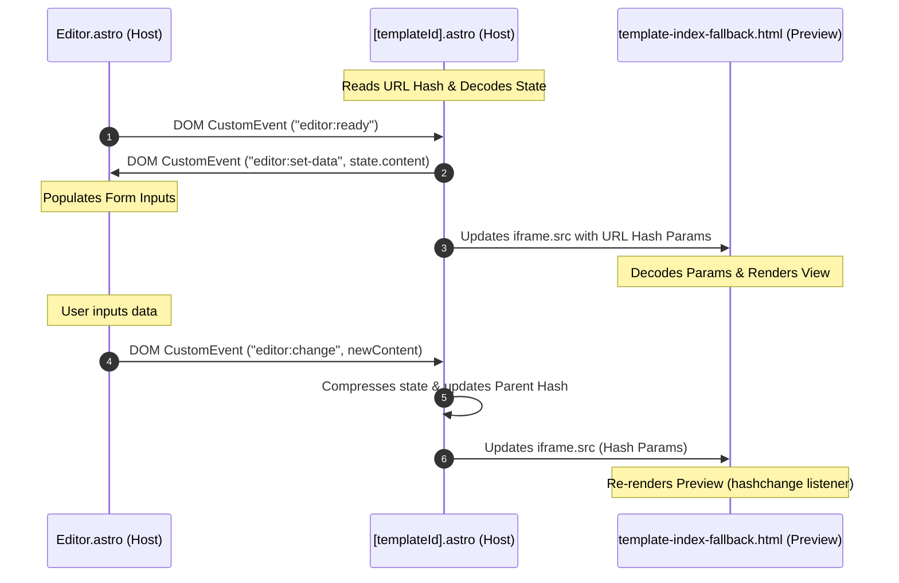

# Architecture Guide

This document explains the technical foundation and data flow of the application.

---

## 💾 Zero-Database Engine

The core design principle is **zero-cost serverless persistency**. Rather than storing user records in a backend database, all card data is stored **entirely within the URL hash** (`window.location.hash`).

### Benefits
* **No hosting costs**: The app can be hosted completely on static providers (GitHub Pages, Vercel, Netlify).
* **Absolute privacy**: User data never leaves the browser.
* **Instant sharing**: Copying and sharing the URL transfers the exact state of the note.

---

## 📦 Oreh SDK

The **Oreh SDK** ([Oreh.ts](file:///var/home/rumen/storage/projects/web/serverless-notes/src/oreh-sdk/Oreh/Oreh.ts)) is the custom state manager responsible for compressing, encoding, reading, and writing state to the URL.

### 1. Compression & Encoding Scheme
To prevent URLs from exceeding standard browser size limits, the SDK uses the native Web `CompressionStream` API:
$$\text{JSON State} \xrightarrow{\text{UTF-8}} \text{Bytes} \xrightarrow{\text{deflate-raw}} \text{Compressed Bytes} \xrightarrow{\text{base64url}} \text{URL Hash String}$$

### 2. State Schema
The compressed state contains a single JSON object with two top-level fields:

```json
{
  "content": {
    "studentName": "Ivan Ivanov",
    "studentClass": "6a"
  },
  "system": {
    "mode": "editor"
  }
}
```

* **`content`**: The raw template field values filled out by the user. This could be anything.
* **`system`**: Application metadata (e.g., whether the page is rendered in `"editor"` or `"viewer"` mode).

### 3. URL Size Limits
Browser URL limits are set to a maximum of **8,000 characters** in `checkStateSize()`. This matches the conservative safe limit supported by popular desktop and mobile browsers.

---

## ⚡ Reactivity & Event Lifecycle

The application decouples the editing controls from the template preview using an `iframe`. The parent layout (`[templateId].astro`), the editor component (`Editor.astro`), and the preview document communicate reactively:



Refer to the [Development Guide](development-guide.md) for technical specifications of these custom events.
